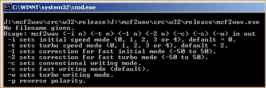

# MZF2WAV
This document covers software to transfer an MZF image to a cassette by using a
WAV file as an intermediate.

## Background
This project is closely related to [MZPut](https://github.com/jfjlaros/mzput),
which is used to transfer an MZF image from a PC directly to an MZ. MZPut was
originally built upon this utility, but later versions of MZF2WAV were inspired
by MZPut.

Also see the related pages:

- [PC tape interface](https://sharpmz.org/mztape.htm).
- [File transfer / Data transfer problem](https://sharpmz.org/mz-700/filetrans.htm).
- [Using an audio recorder](https://sharpmz.org/mz-700/usetape2.htm).

## Installation
### Binaries
There are pre-compiled binaries for
[Linux](https://sharpmz.org/download/mzf2wav32.zip) and
[Windows](https://sharpmz.org/download/mzf2wav.zip). After unzipping the
archive, the binary for Linux can be found in `mzf2wav/src/linux/release`, for
Windows it can be found in `mzf2wav\src\w32\release`.

### From source
Retrieve the source code with Git.

    git clone https://github.com/jfjlaros/mzf2wav.git

To compile for Linux:

    cd mzf2wav/src/linux
    sh build.sh

For Windows, use:

    cd mzf2wav\src\w32
    build.bat

The binary will be placed in the `release` subdirectory.

## Usage

To convert an MZF image named `image.mzf` to a WAV file named `image.wav`, run
the following command:

    mzf2wav image.mzf image.wav

The program recognises the following options:

| option | description
|--------|:--
|   `-i` | sets initial speed mode (0, 1, 2, 3 or 4), default = 0.
|   `-t` | sets turbo speed mode (0, 1, 2, 3 or 4), default = 2.
|   `-1` | sets correction for fast initial mode (-50 to 50).
|   `-2` | sets correction for fast turbo mode (-50 to 50).
|   `-c` | sets conventional writing mode.
|   `-s` | sets fast writing mode (default).
|   `-w` | sets turbo writing mode.
|   `-p` | reverse polarity.

For a full explanation of the different modes of operation, see the section
[operation modes](https://github.com/jfjlaros/mzput#operation-modes) of the
MZPut documentation.

## Related software
Please check out Ricky El-Qasem's
[MZF2WAVGUI](https://github.com/rickyelqasem/MZF2WAVGUI), a graphical user
interface for this project (Windows only). He also made a nice
[tutorial](https://www.youtube.com/watch?v=iwD3-5ENyE8) on how to use this
software to directly connect to an MZ.

## Acknowledgements
The author would like to acknowledge Karl-Heinz Mau for:

- Testing the Windows program and giving feedback.
- [Hosting](https://www.sharpmz.org/mzf2wav.htm) the project.
